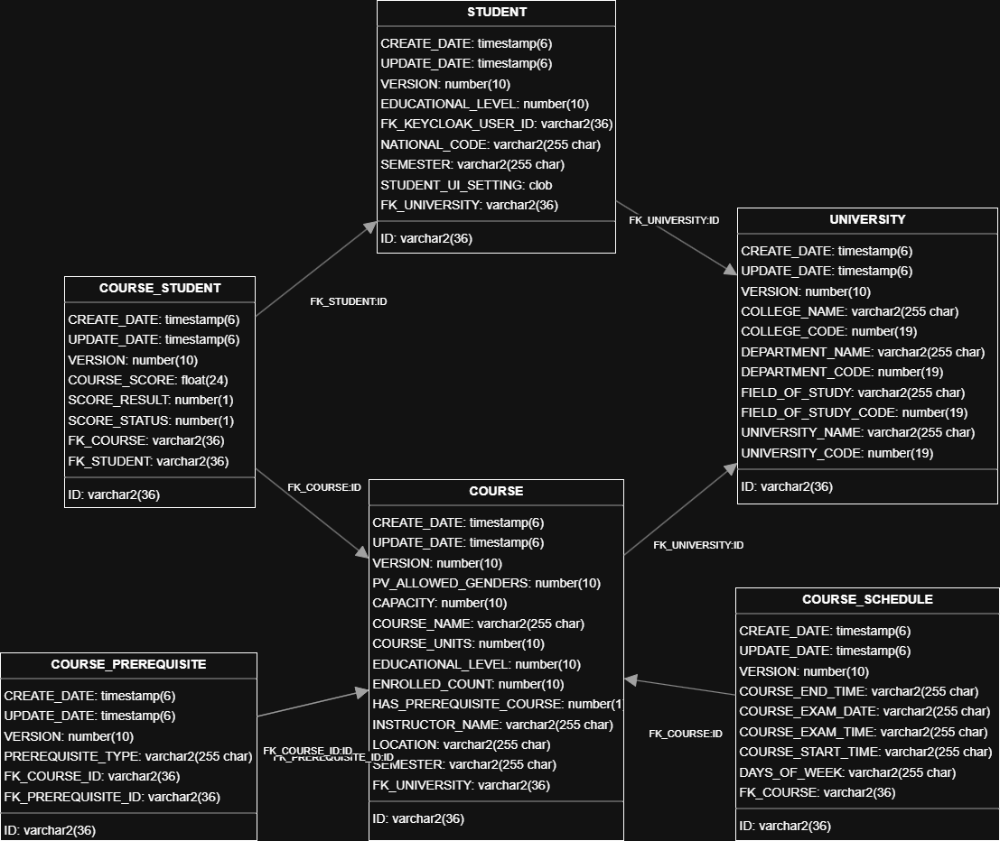

# University Management System
University Management System (UMS) is a full-stack web application designed to streamline and automate administrative and academic operations within a university.


## Tech Stack

**Client:** React, Redux, TailwindCSS, MUI

**Server:** Java, Spring boot, keycloak 


## Features

- Login / Logout with OAuth2
- Courses can be created by admin users
- A list to display specific courses for student users
- Students can enroll in courses
- A form to view scheduled courses along with enrolled students


## Run Locally

Clone the project

```bash
  git clone https://github.com/yazdan-rm/university-management-system.git
```

Go to the project directory

```bash
  cd project-folder
```

Client install dependencies

```bash
  npm install
```

Start the client

```bash
  npm start
```

Start the server

```bash
  mvn spring-boot:run
```

Start the keycloak server

```bash
  kc start
```
## ER Diagram


## API Reference

#### Post course

```http
  POST /api/v1/courses
```

| Parameter | Type     | Description                |
| :-------- | :------- | :------------------------- |
| `api_key` | `string` | **Required**. Your API key |

#### Get course

```http
  GET /api/v1/courses/${id}
```

| Parameter | Type     | Description                       |
| :-------- | :------- | :-------------------------------- |
| `uuid`      | `string` | **Required**. Uuid of course to fetch |


#### Get all colleges

```http
  GET /api/v1/university/get-all-colleges
```

| Parameter | Type     | Description                |
| :-------- | :------- | :------------------------- |
| `api_key` | `string` | **Required**. Your API key |

#### Get all departments by collegeCode

```http
  GET /api/v1/university/get-departments-by-college-code/${collegeCode}
```

| Parameter | Type     | Description                       |
| :-------- | :------- | :-------------------------------- |
| `collegeCode`      | `long` | **Required**. collegeCode for fetch deps |


```http
  POST /api/v1/courses
```

| Parameter | Type     | Description                |
| :-------- | :------- | :------------------------- |
| `api_key` | `string` | **Required**. Your API key |
## License

[MIT](https://choosealicense.com/licenses/mit/)

